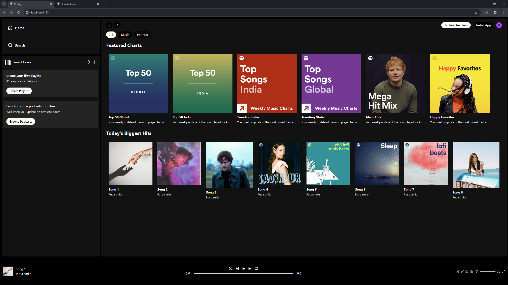
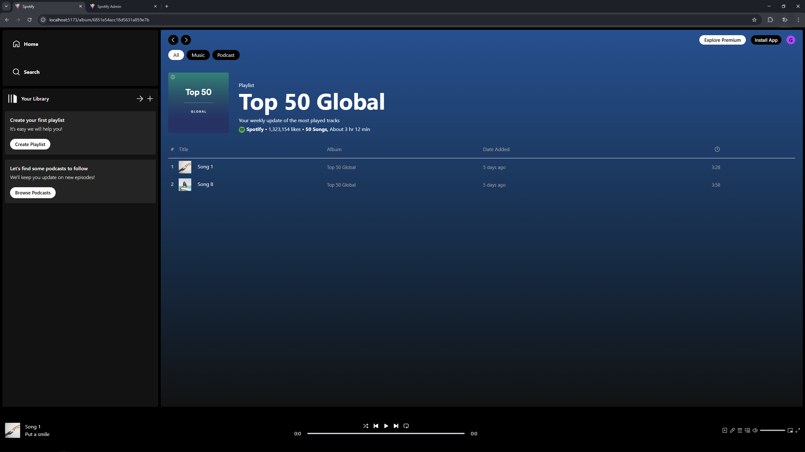
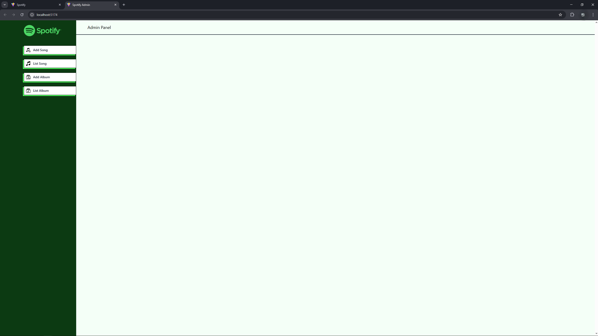
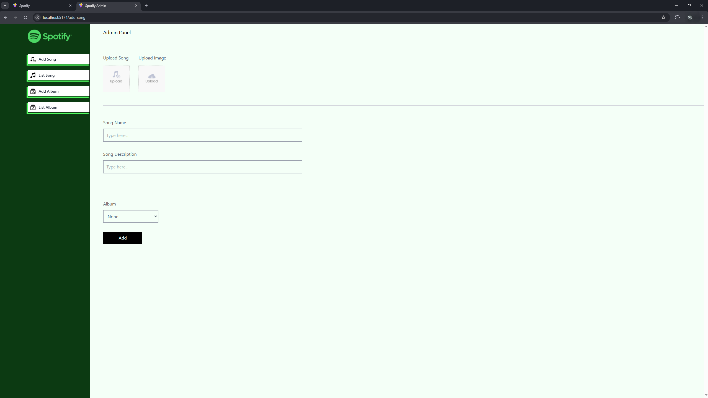
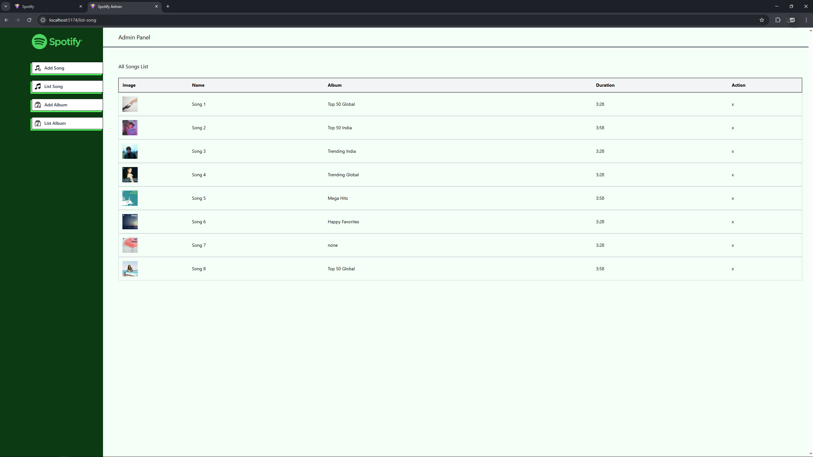
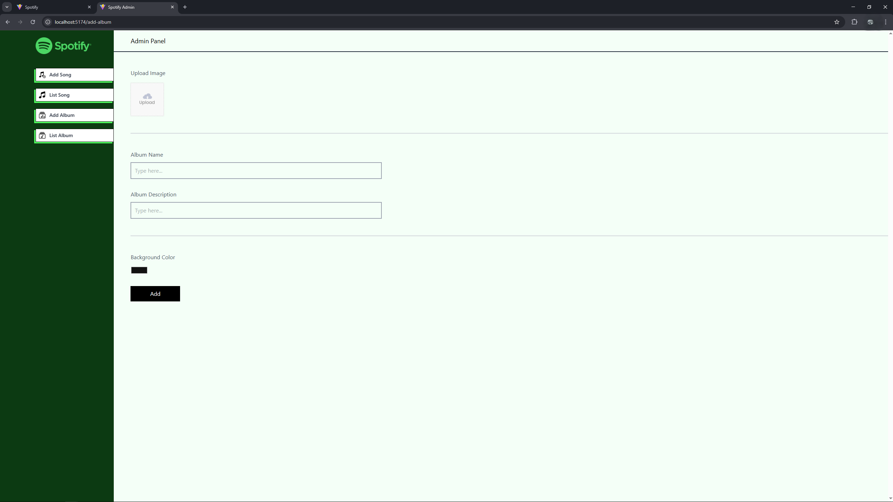
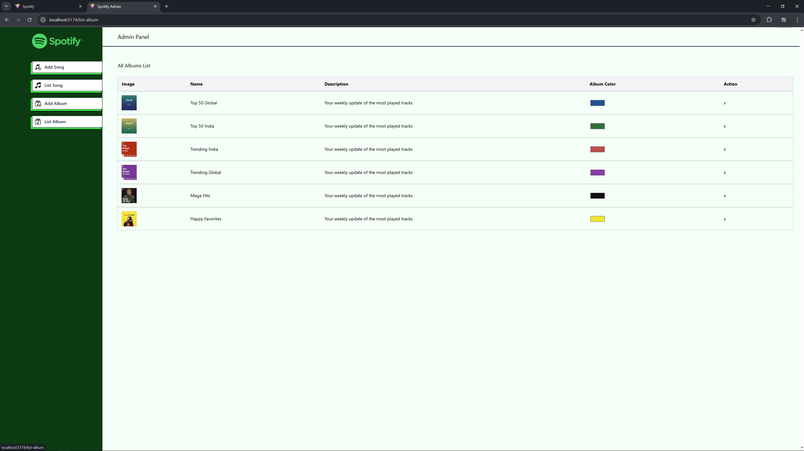

# Music Player Application

This is a full-featured Spotify clone built with the MERN stack (MongoDB, Express.js, React.js, Node.js). 
This project has the basic functionalities, including album and song management, music playback, and an admin panel for content control. 
Media files are stored securely with Cloudinary.

---

## 🚀 Features

- **Album Management:** Create, list, and delete albums with custom images and background colors.
- **Song Management:** Upload, list, and delete songs with audio and artwork.
- **Music Playback:** Play, pause, skip, and seek tracks.
- **Admin Panel:** Manage albums and songs through a secure admin interface.
- **Cloud Storage:** Store images and audio files with Cloudinary.

---

## 🛠️ Tech Stack

- **Frontend:** React.js, Tailwind CSS, Axios, React Router, React Toastify
- **Backend:** Node.js, Express.js
- **Database:** MongoDB (Mongoose)
- **Cloud Storage:** Cloudinary

---

## 📦 Project Structure

- **spotify-full-stack/
- **├── spotify-clone/  
- **├── spotify-admin/  
- **└── spotify-backend/ 
  
---

## ⚙️ Installation & Setup

1. **Clone the repository:**

  ```
  git clone https://github.com/your-username/spotify-full-stack.git
  cd spotify-full-stack
  ```

2. **Set up environment variables:**
- Create a `.env` file in `spotify-backend/` with:
  ```
  MONGODB_URI=your_mongodb_uri
  CLOUDINARY_NAME=your_cloudinary_name
  CLOUDINARY_API_KEY=your_cloudinary_api_key
  CLOUDINARY_SECRET_KEY=your_cloudinary_secret
  ```

3. **Install dependencies and run servers:**

**Backend:**
  ```
  cd ../spotify-backend
  npm install
  npm start
  ```


**Admin Panel:**
  ```
  cd ../spotify-admin
  npm install
  npm run dev
  ```


**Frontend:**
  ```
  cd ../spotify-clone
  npm install
  npm run dev
  ```

---

## 📋 Usage

- Use the **admin panel** to add albums and upload songs.
- Browse albums and play songs in the user-facing app.
- All media is uploaded and served via Cloudinary.

---

## 📸 Screenshots

### Home Page


### Album View


### Admin Panel


### Add Song


### List Song


### Add Album


### List Album


---


## 🙏 Acknowledgements

- [Cloudinary](https://cloudinary.com/) for media storage.
- [MongoDB Atlas](https://www.mongodb.com/cloud/atlas) for free cloud database hosting.

---

> **Created and maintained by [Gjorgi Stamkov](https://github.com/gjorgistamkov).**
